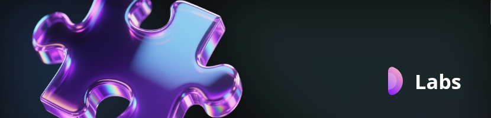
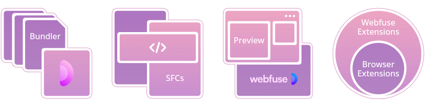
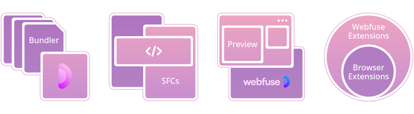

<a href="#webfuse-labs" target="_blank"></a>

# Webfuse Labs

> [**Webfuse**](https://webfuse.com) is a web augmentation platform to instantly extend, automate & share any web session. Webfuse extensions are browser extensions, but enhanced with a powerful augmentation API.

**Labs** is a framework that facilitates web extension development: Build with a bundler made for extensions, in a local preview environment. It supports Typescript and SCSS out-of-the-box, and also [Vue](https://vuejs.org/guide/scaling-up/sfc.html)-inspired single file components. Imagine [Vite](https://vite.dev), but for extensions.

<p align="center">
  <a href="#browser-webfuse-api" target="_blank"></a>
</p>

1. [**Prerequisites**](#prerequisites)
2. [**Installation**](#installation)
3. [**Preview**](#preview)
4. [**Assets**](#assets)
5. [**Browser & Webfuse APIs**](#browser--webfuse-apis)
6. [**Session Integration**](#session-integration)
7. [**CLI Reference**](#cli-reference)
8. [**Cheatsheet**](#cheatsheet)
9. [**Further Reading**](#further-reading)

## Prerequisites

- [Node.js + NPM](https://nodejs.org) v22+/v10+
- [Webfuse](https://webfuse.com/studio/auth/signup) Account

## Installation

Run the below command to install Labs. It becomes available in your command line interface (CLI) as `labs`.

``` console
npm i -g surfly/labs
```

> You might need to execute the above command with admin priviliges. Try `sudo npm i -g surfly/labs` – at your own risk. Otherwise, create a wrapper directory, and install Labs on project level:
> ``` console
> mkdir with-labs
> cd with-labs
> npm init -y
> npm i surfly/labs
> ```
> Prefix all subsequent `labs` commands with `npx`, e.g. `npx labs create`.

Use `labs` with the `create` command to scaffold an extension project:

```  console
labs create
cd my-extension
```

## Preview

Extensions can be uploaded to Webfuse through a neat session user interface (UI) dialogue. In a prototyping or incremental development process, however, this is unfortunate. Natural browser and file system boundaries force it to become a redundant task. With Labs, you can instead preview the latest state of your bundle right on your local machine. The following command spins up the preview environment:

``` console
labs preview
```

The preview app is a browser application. Open the address that is printed to the console in a web browser. The preview environment implements hot module replacement. This is, the provided UI always presents the latest bundle.

<a href="#local-development" target="_blank"></a>

> All `labs` commands work in the current working directory, which must hence correspond to an extension project's root directory.

## Assets

The scaffolded project resembles the following file structure:

```
.                                       # Extension root directory
└── /my-extension
    ├── /dist 🛠️                        # Eventually emitted files, for upload in a session
    └── /src                            # Source files to edit
    │   ├── /newtab                     # Newtab target files
    │   │   ├── newtab.html ❕
    │   │   ├── newtab.[css|scss]
    │   │   └── newtab.[js|ts]
    │   ├── /popup                      # Popup target files
    │   │   ├── popup.html ❕
    │   │   ├── popup.[css|scss]
    │   │   └── popup.[js|ts]
    │   └── /shared                     # Shared files
    │       ├── /components             # Single file components ('SFCs'), see below
    │       │   └── my-component.html
    │       ├── shared.[css|scss]
    │       └── shared.[js|ts]
    ├── background.js                   # Background script
    └── content.js                      # Content script
```

The `/src` directory contains all individual extension files. Edit them to your needs. Aligned with browser and Webfuse terminology, Labs constrains the file structure and naming in order to enforce consistency across extensions: There is an asset directory targeting each a new tab (_'newtab'_), and the popup window (_'popup'_), as well as a directory shared among both aforementioned (_'shared'_). The target directories require exactly one markup file, and may optionally contain a stylesheet and a script file. Moreover, a shared stylesheet and script may be provided to the shared directory. Also, each directory may contain a components directory that contains Labs-specific single file components, i.e. reusable markup (more details below).

Run the `bundle` command to emit your session-ready extension bundle to the `/dist` directory:

``` console
labs bundle
```

The bundler automatically runs with the preview environment. Once your preview is up and running, there is no need to run the `bundle` command everytime you edited the source.

> You do not have to specify a `manifest.json`. Labs takes care of all the metadata. In particular, it copies the name and version fields from `package.json`.

### Markup

Markup is automatically wrapped within proper document syntax. There is hence no need to declare doctype, `<html>`, `<head>`, or `<body>`.

<sub><code>src/newtab/newtab.html</code></sub>

``` html
<strong>My Extension</strong>
<h1>Newtab</h1>
<p>
    This is presented in each new tab in a session.
</p>
```

### Style

Stylesheets can either be encoded with CSS (`.css`) or SCSS (`.scss`). Labs specifies a handful of normalized styles (see [global.css](./lib/bundle/global/global.css)).

<sub><code>src/newtab/newtab.css</code></sub>

``` css
h1 {
  font-size: 2rem;
}
```

### Script

Scripts evaluate in the respetive target's global (window) scope. Globals declared in the `shared` target script are furthermore accessible from both targets. Scripts can either be encoded with JavaScript (`.js`) or TypeScript (`.ts`).

<sub><code>src/shared/shared.js</code></sub>

``` js
function randomGreeting() {
  return [ "Hello", "Hi", "Hoi" ]
    .sort(() => Math.round(Math.random()))
    .pop();
}
```

<sub><code>src/popup/popup.js</code></sub>

``` js
function sayHello() {
  document.querySelector("p")
    .textContent = `${randomGreeting()} from Popup.`;
}
```

### Single File Components

Labs introduces a lean single file component (SFC) interface. Every SFC is declared in its own file, which must be a direct child of a `/components` directory. A dedicated `/components` directory works for each asset directory – i.e. a target or the shared directory. An SFC's filename (without the extension) dictates the related tag name. A tag name is furthermore always prefixed (namespaced) with `sfc-`.

<sub><code>src/shared/components/my-component.html</code></sub>

``` html
<template>
  <button type="button">
    <slot></slot>
  </button>
</template>

<script>
  connectedCallback() {
    console.log("SFC attached to target.");
  }
</script>

<style>
  button {
    cursor: pointer;
    outline: none;
    border: none;
  }
</style>
```

<sub><code>src/newtab/popup.html</code></sub>

``` html
<strong>My Extension</strong>
<h1>Newtab</h1>
<p>
    This is presented in the popup window.
</p>

<SFC-MY-COMPONENT onclick="sayHello()">Say Hello</SFC-MY-COMPONENT>
```

A valid SFC file assembles from at most one of the following tags (top-level): `<template>` can contain the component markup. It can be leveraged with [slots](https://developer.mozilla.org/en-US/docs/Web/API/Web_components/Using_templates_and_slots#adding_flexibility_with_slots). `<style>` can contain styles that apply only to the component markup. `<script>` can contain native web component [lifecycle callbacks](https://developer.mozilla.org/en-US/docs/Web/API/Web_components/Using_custom_elements#custom_element_lifecycle_callbacks), and utilize related concepts.

> SFCs work with SCSS and TypeScript by specifiying a `lang` attribute on the respective tag. This is, `<style lang="scss">` or `<script lang="ts">`, respectively.

## Browser & Webfuse APIs

The Labs preview environment primarily enables incremental development of the extension UI. Extensions do certainly subsist on [Browser APIs](https://developer.mozilla.org/en-US/docs/Mozilla/Add-ons/WebExtensions/API), and the [Webfuse API](https://docs.surfly.com/webfuse/extensions/api_reference). API-based functionality, on the other hand, is strongly tied to a browser and session environment. A Labs preview is considered 'flat', i.e. it mocks all relevant APIs, but only for it to exist. Any API call logs a debug message to the console to verify it would have happened.

> API mocking is work in progress (Promise APIs, etc.).

## Session Integration

Follow the [Official Documentation](https://docs.surfly.com/webfuse/extensions/introduction#extension-directory-upload-handling-and-limitations) to install your extension to a Webfuse session. This holds for both use in production, as well as verification with full browser/session capabilities. In a nutshell, this comprises three steps:

1. Open your Webfuse session,
2. navigate to the Extensions tab, and
3. use the upload option.

> Select the `/dist` directory for upload.

## CLI Reference

### Synopsis

``` console
labs <command> [--<argument> [<option>]?]*
```

`--stacktrace` &emsp; Print stacktrace of non-recoverable exceptions  
`--working-dir` &emsp; Specify working, i.e. extension directory &emsp; `./`  

### Commands

#### `create`

Create an extension project blueprint.

`--path`, `-P` &emsp; Path to create blueprint at &emsp; `./my-extension`  

#### `bundle`

Bundle and emit extension source files.

`--debug`, `-D` &emsp; Skip minification of emitted files  
`--watch`, `-W` &emsp; Watch files for incremental builds  

#### `preview`

Spin up the preview environment.

`--only` &emsp; Just serve preview, without implicit bundle (watch)  

> Use the `help` command to display usage description in the CLI.
## Cheatsheet

**Setup:**

1. `npm i -g surfly/labs`
2. `labs create`
3. `cd my-extension`

**Workflow:**

1. `labs preview`
2. Edit `/src`.

**Upload:**

1. `labs bundle`
2. Upload `/dist` to Webfuse session.

## Further Reading

- [Webfuse - The web augmentation platform](https://www.webfuse.com)
- [Webfuse Extensions](https://docs.surfly.com/webfuse/extensions/api_reference)
- [Browser Extensions](https://developer.chrome.com/docs/extensions/get-started)
- [Introducing: Web Augmentation](https://www.webfuse.com/blog/web-augmentation)

<br>
<a href="https://webfuse.com" target="_blank"></a>

<p align="right">
  <sub>&copy; Surfly B.V.</sub>
</p>